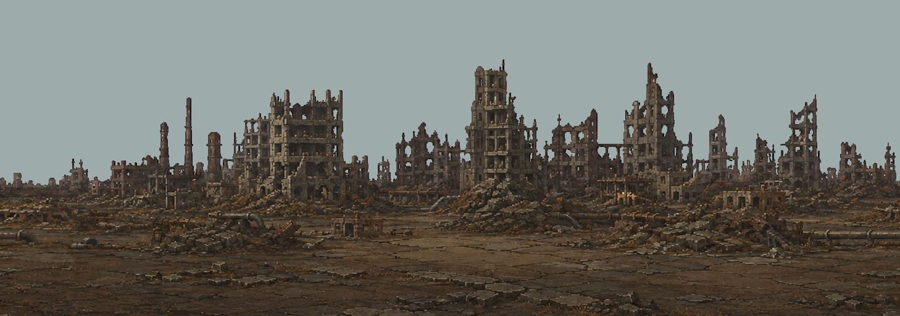
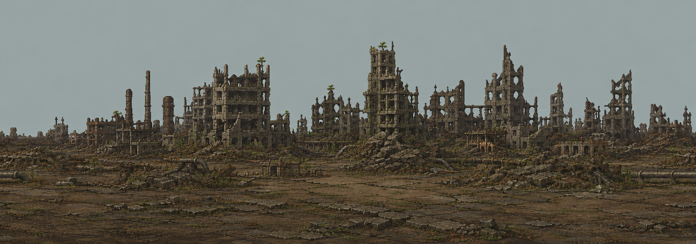
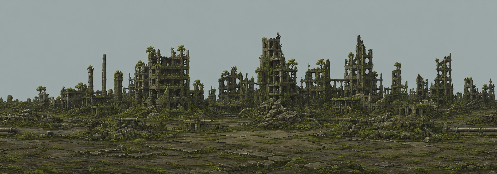

# Wastes reclamation v1 — Far city concept review

September7,2026. Built-in image-generation tool, not CLI/API fallback.
Exact prompts: [PROMPTS.md](PROMPTS.md). No art here is installed or a game capture.

**User review accepted:** "yes that looks great" confirms the vegetation style
shown in the denser study. Proceed with registered vegetation-only authoring;
do not repeat the style-approval question. This does not approve changed masonry,
opaque mattes, runtime dimensions, a calibrated 100% endpoint or live rendering.
The user also proposed this method for Maw sleep/awakening, recorded separately
in `MAW_DORMANCY_VISUAL_DIRECTION.md`.

## Existing barren city — cropped source on a solid review backing

## Early returning life — sparse growth across the skyline

## Denser growth study — not the fully living endpoint yet

Broad ruin placement remains recognizable; moss, turf, vines and trees occur
across left/center/right. But both generated studies repaint masonry and change
details, dimensions and pixel scale. They are **references, not replacements**.
Saved sources were not resized. Any display fitting is for review only.

The denser image still reads as partly recovered, with extensive bare ground and
few substantial leafy trees. Full recovery needs broader living ground and more
rooted trees, retaining readable damaged architecture. Its generated filename is
kept for provenance; it is **not approved as the100% endpoint**. Vegetation style
is now accepted; final density and native Terraria-scale readability retain their
own review. Do not automatically regenerate the accepted buildings to solve that gate.

## Provenance

| File | Actual pixels | Role |
|---|---:|---|
| City-Barren-Reference.png | 1458x512 | Original Far crop with solid backing |
| City-Early-Concept.png | 2115x743 | Sparse vegetation study |
| City-Reclaimed-Concept.png | 2116x743 | Denser vegetation study |

Barren source: `../WastesFarCity-v1/Runtime-v1/Far.png`, rectangle `(0,240,1458,512)`,
`Tools/Preview-BackgroundCrop.ps1`, scale1, backdrop `9DACAA`. The original
1458x1792 runtime source is unchanged. This upper-city crop does not test the
layer's complete deep coverage, transparency or wrap seams.

SHA256:

- Original Far: `D61106D719B292675607B8D9275BDCA73BE7CE01D9405606CF04EB8D1C966FE6`
- Barren: `EE89AC1AC83018DA23A4FF6AAB23B6EE55444E2F7F128A2F1A6ACBA90F98F4FF`
- Early: `0736E42262A325B3A5BCC6FD36A5ECC6F9A5F39C954BE1FBCB5F3EE0C79CFCEC`
- Denser: `8EFD7CEF1419FEF5AAD123173B7E2F29370085A797DA952E14089FFAFD9AFADC`

Unchanged generated originals were copied from this task's Codex generated-images
directory, `01a05af6-a783-7c71-95d1-747436f4fdbc`:

- Early: `exec-0a87bef8-f89a-477c-8139-07afcf39ab99.png`
- Denser: `exec-a4ff33d9-bac0-4f25-ac33-c5e1d939d115.png`

Both prompts requested1458x512; actual dimensions take precedence. Both studies
have opaque inspection backdrops. Never globally color-key them or resize them
back and call that an invariant-preserving edit.

## Pre-install guard — correctly rejected

The actual `Tools/Test-BackgroundReplacement.ps1` was run against the barren
crop for each study. Both exited1 with `DIMENSIONS_CHANGED` and
`NO_TRANSPARENT_PIXELS`; both have zero partially transparent pixels. Reports:
[Early](Early-ReplacementGate.json), [denser](Reclaimed-ReplacementGate.json).
Different sizes make pixel-change counts unavailable; visual inspection separately
shows shading/detail drift. These are expected rejections of opaque concepts
**as runtime replacements**, not successful transparent exports or static passes.

## Next gate

With vegetation style accepted, author registered plant-only layers/masks on the
original city. Base pixels must remain exact outside reviewed plant occlusions.
Keep stable cluster identities across stages; no fades between regenerated
panoramas. Prove light/dark cutouts, separated early-growth regions, alignment,
full depth/wrap, residency and native lighting/flight/biome behavior before promotion.

Close/Mid reclamation art is not authored here. Their accepted barren art is fixed.
`WASTES_RECLAMATION_DIRECTION.md` records the draft global measure and tested
offline curves; these paintings are not calibrated to numeric world percentages.
