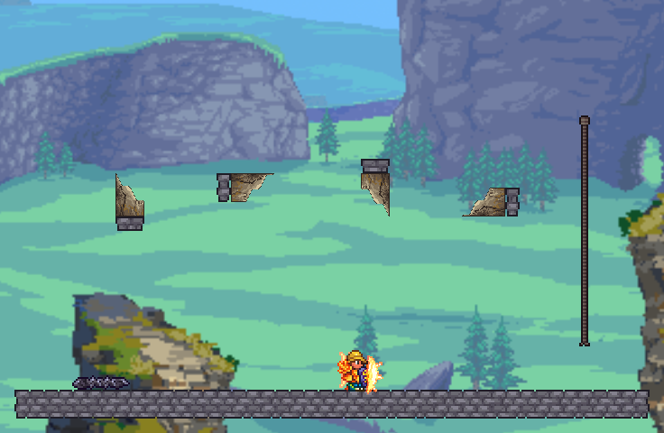

# One solid Maw fang — bounded native prototype

Status: fixture-pass, user art review pending. No mouth integration, acid,
new enemies, ordinary-world edits, or added mod dependencies.

Four orientations on artificial GrayBrick supports; vanilla Spikes at lower
left and rope at right. The player provides native scale. Each upright tooth
is32x48 pixels, slightly taller than the basic42px player collision height.
These are real CaptureManager images, NOT offline drawings. Capture deliberately
uses the known-safe vanilla water/biome slot; the forest/HD resource-pack scenery
is not evidence of Wastes/Maw background routing. The Windows client displays
the accepted Wastes scenery separately. No custom tile renderer or added light.
`native-night.png` is intentionally dark; the player's solar equipment lights
the floor. Final dental anatomy/lighting and contextual visual readability remain
review items. This is an angular wedge prototype, not a final collection of horns.

## What passed

Named single-player `gg` / `Apogee Native Visual V3` only. New46x30 fixture at
X4956,Y500 was placed in a surveyed empty envelope. Existing terrain, saved
bone fixture and preserved grove were not cleared. The trial slot restores to
empty and deletes only newly spawned test Bone drops inside its bounded area.

- First175 native programmatic checks passed14:29:25 local time.
- Actual save completed14:31:24; game was closed, clean final build installed,
  and same world reopened. Saved explicit frames/air/slope cells passed14:34:31.
- Expanded199-check matrix passed14:34:39 after reload. `native-checks.log`
  retains filtered native log lines, not a synthetic test transcript.
- All20 occupied parts in four orientations: starter pick power35 mines in
  three calls; entire fang disappears with exactly one Bone. Trial drop is QA
  tuning, not a final crafting economy/portable-fang item.
- Occupied placement refused; support removal cleans each whole object with
  one drop. Actual native atlas54x216 is loaded with explicit valid frames.
- Native `Collision.SlopeCollision` independently resolves each of the eight
  diagonal cells, leaves their empty side clear, and stops colliding when
  actuated. Empty cells in the3x3 envelope are actual air.
- Shape-aware contact skips air and an actuated tip. An isolated Player instance
  loses30 HP through native `Player.Hurt`; the next contact is blocked by normal
  immunity. This is not a manually controlled fresh-character traversal test.
- Explosion permission returns true; no actual bomb simulation is claimed.
-20 frame roundtrips,1280 independent pixel cases and complete alpha/occupancy
  checks pass offline. Five defective atlases are rejected by the real validator.
  A swapped180/270 slope mapping was caught and fixed before the native build.

Still pending: user review of the native tooth, real player movement/rope and
manual mining feel, multiplayer, paint/coatings, broader supports/settings and
actual explosives. Rope is a QA control, NOT preplaced rope for the Maw. This
floor is a lab scaffold, NOT a safe ledge in generated content. No enemy damage
or drop-through behavior. The199 API checks do not certify the entire feature.

Known unrelated preserved-grove reload mismatch stays RED, never rebased:
expected87B951FE..., pre-tooth actualBA35565A..., candidate-build actualE0036087...
on both candidate loads. Registration changes can affect numeric-ID hashes, but
the cause was not diagnosed here. Within-session guards were unchanged; that
is narrower than accepting the old grove's reload test.

## Reproduce and preserve accepted work

Candidate: `Art/Candidates/MawTooth-v1/Native-v1`, with source/prompt/mask history
and lossy fitting disclosed in its parent README. Exact atlas SHA256:
`52DFA889B6CFADED43D9997E870D2EBCA0BE991188E29AF29616CE226DBC3D68`.
Final installed QA package SHA256:
`6A5670B51EB7AC2372F727ACD8307D44123924B9881901F4F5FFA94BE836F053`.
Build7.28s, zero warnings/errors. It retains every accepted optional Wastes,
pod and quiet-bone override: all410 preceding Content PNGs hash-identical,
one new candidate fang image (411 total). Add `-MawFangCandidateDirectory
Art/Candidates/MawTooth-v1/Native-v1` to the complete bone-evidence build command;
never run a bare build and assume it retains the accepted candidate bank.

Stop/save the game first. The isolated builder installs the package. The tooth
asset only enters its temporary mirror; repository Content PNGs remain unchanged.
Before tests, package/V3/gg backups were taken in local Temp under
`ApogeanToothBackup-2d0e661baa9f4d8d807a7fbb6c13f229`; never commit player/world files.

Use `Tools/Request-MawFangValidation.ps1`: `reload`, `test`, `day`, `capture`,
`night`, `capture`, `save-and-quit`, one request at a time, checking log consumption.
`build` is first-time only and refuses an existing fixture. `release` restores
temporary view state. Do not use a regular world. The entrypoint returns before
the legacy destructive fixture-replacement branch. Final release/save completed
14:37:58 and the native window was verified back at the main menu.

Next: visual review and real traversal check, then a bounded mouth integration
pass using the already-approved raised rims/dense teeth. Preserve the safe
structural bone, no-safe-ledges design, Stomach reservation and optional acid#27.
