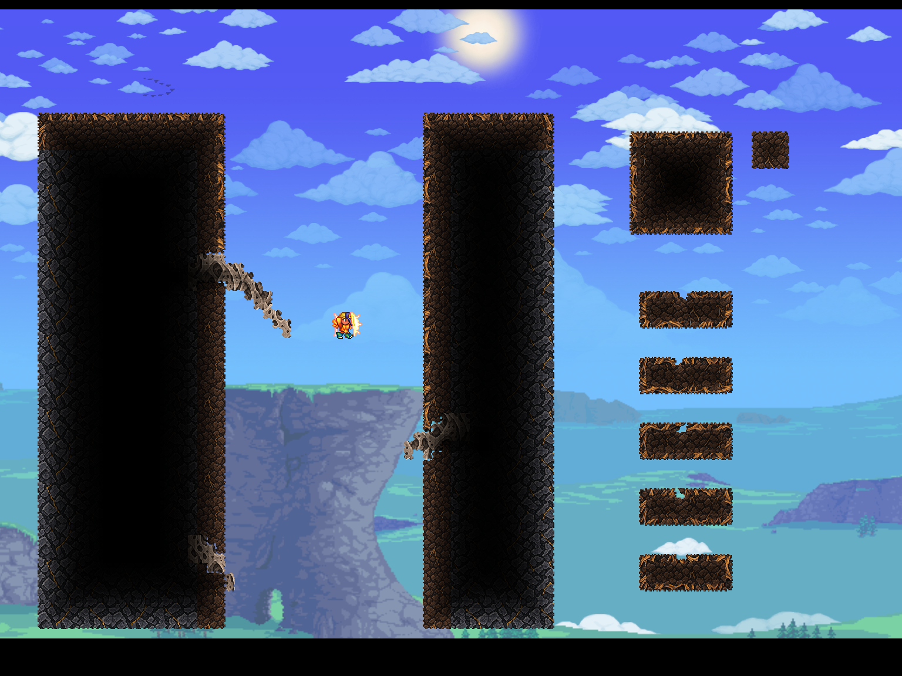

# One native fiber / structural-rib study

September11, 2026. **Growth/persistence proof, not final art or worldgen.**
User approved a bounded study after the existing mixed-material join repair.
The Apogean content, atlas and structure workflows kept this separate from
normal-world terrain and from approved material galleries.

## Actual result

- New empty96x72 envelope at **7596,240** in **Apogee Native Visual V3**,
  character **gg**, single-player. No preexisting terrain cleared.
- Eight grass seeds grew to **247 grass cells** in48 explicit bounded steps;
  each step permits at most8 conversions. Later steps reached0 pending changes.
- Actual MawDirt becomes MawGrass only at exposed faces connected to existing
  growth. The isolated11x11 sample wraps floor, both sides and ceiling. Its
  buried core stays soil; the separate4x4 unseeded island stays soil.
- Five lower samples exercise the four native slopes and a half block.
- All **63 bone cells** remain bone. Grass stops at the rib interruption;
  this is not a coating for stone/bone and does not consume them.
- Save to the menu and reopen the SAME world: step48, grass247, bone63 and
  all6912 expected cell states persist. `reload` validates; it never rebuilds.
- The native material suite and join regression remain separate. This study
  does not change their original layout hashes or rewrite the legacy grove.



`before-growth.png`, `after-growth.png`, `after-reopen.png` are unedited native
CaptureManager outputs,1536x1152. Their sky/background is the QA capture's native
forest/active resource-pack backdrop, **not a new Maw background**. Black image
borders are retained. The camera holds the test character still; these pictures
are not descent/collision tests. Ordinary enemies were not suppressed; the
equipped player's effects can appear in the captures.

## Contract and current package

- `MawFiberGrowthPolicy`: pure two-phase planner, read-only one-cell boundary,
  at most32 planned updates, blocked cells and other host identities excluded.
  Only the QA adapter's8-cell budget is used here. No production timer/hook.
- `MawFiberRibLab`: gg/V3/SP AND packed-preview guard, finite empty-site search,
  pre-write actual-state verification, explicit saved maturation count.
- Original plan digest:
  `C27DE4D91F3AFA5EFC8328FE3C8434F4209D78496FABA66BC4382081149EE17C`.
- Current tmod SHA256:
  `528701648FB170C4A2239D263A0A60E49BE5550664E43268E1E755B685094A0D`.
- Full pinned build passed0 warnings/errors;466 accepted texture/map bytes
  unchanged. No art was regenerated or silently substituted.
- `Invoke-ApogeanContentGate.ps1 -Profile MawMaterials` passes all six offline
  gates, including38 growth-policy checks. Those tests independently expect
  a16-cell perimeter around a buried5x5 soil sample, and reject air jumps,
  protected sources/targets, other hosts, disabled growth and invalid budgets.
- Native validation checks actual type/slope/half-block, walls/liquid, paint,
  wires, actuators, invisibility/fullbright against the original+replayed plan.
  Policy replay is not an independent renderer oracle; screenshots and the
  pure independent expected-perimeter checks provide separate evidence.

`first-session.json` and `reopened-regression.json` retain scoped native records.
The installed build is still the **opt-in QA preview**: only use disposable
worlds with it. No normal-world generation, acid, vines, shaders or dependency
installation is included.

## Not accepted yet

1. Small sky-colored openings remain at the new **bone / soil / grass rib
   attachments**. The repaired bone/study-fiber and bone/study-membrane pairs
   are different. Diagnose the actual local root around20,27 and49,44 before
   adding relationships; compare complete native exposed neighborhoods and
   account for grass overlays. Do not fill gaps with background walls.
2. Fiber uses the existing accepted grass artwork. A thicker rooted, less
   choppy surface coat still needs its own art/native review. This proof is
   growth behavior, not fulfillment of the thickness request.
3. Three uneven rough arcs establish material scale only. They are not final
   rib anatomy, a validated hazardous route or a replacement for old shelves.
4. Vines, stone/bone coatings, real protection adapters, dormancy/intrinsic
   infection, purification interaction and multiplayer remain separate gates.
5. Test actual rope/mining, hook, double-jump, fall-protection and unprepared
   traversal after the attachment/art correction. No forced damage, supplied
   rope or rhythmic safety staircase. Preserve the Stomach/enclosed outlet.
6. Existing grove reload mismatch remains RED: expected87B951FE, actual9D21A431
   in these loads. It predates this study and was not rebaselined. Within-request
   grove guards pass; that does not resolve the cross-reload failure.

## Resume without rebuilding

Load only gg / Apogee Native Visual V3 with the pinned QA package. From repo root:

```powershell
pwsh -NoProfile -File Tools/Request-MawFiberValidation.ps1 -Case reload
pwsh -NoProfile -File Tools/Request-MawFiberValidation.ps1 -Case view
pwsh -NoProfile -File Tools/Request-MawFiberValidation.ps1 -Case capture
pwsh -NoProfile -File Tools/Request-MawFiberValidation.ps1 -Case release
```

These are separate requests: wait for each actual `MAW FIBER COMPLETE` record
before sending the next; capture also needs its delayed PNG to finish. Do NOT
send `build` again or mature further just to make a screenshot. The completed
growth state is saved. `release` restores the prior player position/time.

Next bounded change is attachment-edge diagnosis on this same scene, followed
by thicker grass and anatomy. Do not expand the biome while that remains open.
