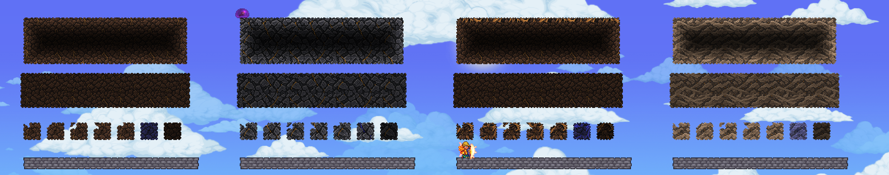
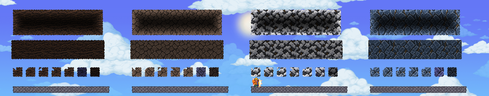
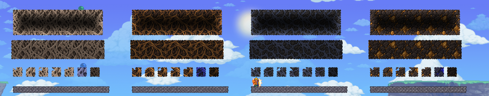

# Harsh Maw materials — native QA

Date: September9 local / September10 UTC. State: **renderer fixture pass; native gallery appearance accepted; production pending**.

User follow-up: "looks great! im going to sleep now so we shall work on this tomorrow". Approval applies to the demonstrated native materials. Pause here; no overnight run or automation. Resume with one bounded mixed natural Maw section, actual grass/soil corner slopes and material boundaries. Preserve this art instead of reopening the same style approval. Remaining gameplay/memory/generation gates below are unchanged.

The approved harsh board now has twelve original material fields compiled into twelve native tile candidates and twelve matching darker wall candidates. They are installed in the disposable QA package. Existing Maw terrain/generation is not replaced yet.

## Actual Terraria captures

Each row shows broad solid fill, overlapping background wall, then four slope specimens, a half block, blue paint and actuation. The grey platform is only a test stand, not a proposed Maw ledge. The character and slimes provide real game scale. The sky is the capture backdrop, not a finished Maw background.

Soil / stone / grass / sand:

Mud / clay / snow / ice:

Bone / fibers / membrane / amber:

[Night comparison](family-row3-night.png) · [Same fixture after save/reopen](family-row1-reloaded.png).

Full originals2432x480; viewers may scale them down. Open at100% to inspect pixels. No screenshot repainting, composite tiles or injected illumination. Warm local light is from the QA player's equipment. Amber is deliberately non-emissive in this art-only study; it does not demonstrate the planned organ light.

## Evidence

- Package SHA256: `2558EE6F3A63FD1BBD2352CA3624C123A584466B523F07A2B028EB46638E2F8B`.
- Corrected package built with0 warnings/errors, then loaded successfully. Initial derived-class registry lookup failed before any world was entered; corrected to ModTile/ModWall lookup. That failure is not hidden.
- Family created once in verified empty air at5796,360,152x94 in **gg / Apogee Native Visual V3 / single-player**.
- Named-state fingerprint: `D5059C3066ED8D42F26FE5113AACA2101E0549FA552E91ABAB9A36A60C5A59AF`.
- Before save21:31:50 and after reopen21:34:58:3444 actual native TileLoader draw calls and1680 wall frame mappings pass. No saved frame or geometry changes. Fingerprint checked before/after tests; no fixture replacement.
- Last QA save/quit21:35:20; world save validated; tModLoader returned to menu. Regular worlds were not opened.
- Packed exporter:148,945,920 reconstructed native-frame pixels; runtime map1,326,272 valid/invalid cases; eight deliberately damaged compiler controls all rejected as expected, including overlapping wall pixels and transparent padding.
- Earlier stone-only proof:13 native property checks and340 draws, including58/59 pick-power boundary, collision and actuation, before/after save/reload. Explosion permission only, not a real bomb. [Day](stone-v2-day.png), [night](stone-v2-night.png). [v1](stone-v1-rejected.png) rejected internally for mirrored repetition.
-416 existing Content PNGs compared with the previously accepted isolated build: unchanged.25 new diagnostic PNGs only. User's unrelated localization/research edits preserved.
- [Source prompts, image hashes and capture hashes](provenance.json); [compiler and contract notes](../../Candidates/MawTerrain-Harsh-v1/IMPLEMENTATION.md).

## Appearance judgment and remaining gates

The native samples no longer show the old16px white graph-paper effect. Stone/soil read as broader material surfaces; flat grass/soil transition and inspected native slopes have no obvious exporter-white leak. Connected topology is not automatically good art:8-tile periodic repetition is still visible, particularly in bone/fibers/snow, and needs a mixed natural-context fixture. Hanging roots, irregular large ribs, teeth and localized glowing organs are separate assets.

These slope specimens do **not** prove every grass-to-soil corner/neighbor combination. Test actual mixed substrates before promotion. No sand falling/projectiles, drops, purification, cross-material merge, multiplayer, coating suite, performance benchmark or production generation acceptance is claimed.

The24 candidate textures occupy245.79MiB uncompressed before paint caches; this is a QA budget. Consolidate production/candidate ownership and assess memory before release. Do not blindly copy packed PNGs onto existing classes: native frames require the paired draw-only map.

The old grove reload mismatch remains RED. Expected87B951FE..., first family loadEF09F1F1..., reopen9D21A431...; full values in implementation notes. No repair/rebaseline was attempted. Within-request guards only prove this family action left the grove unchanged at that moment.

## Next bounded step

Review these in-game materials against the board, then build one mixed natural Maw section in a separate empty QA site. Include real grass/soil slopes, material joins and sparse bone/fiber patches. Keep no-safe-ledges generation, tooth placement and acid in their own gates. Promote existing terrain classes only after that proof; ordinary worlds remain untouched.

To revisit the saved gallery: select gg and Apogee Native Visual V3, then run `Tools/Request-MawFamilyValidation.ps1 -Case row0` (or row1/row2). Await each request's consumption. `reload` verifies the saved fixture; **do not run build again**. `release` restores the player's previous position/time. The helper refuses all other worlds/players/network modes.
