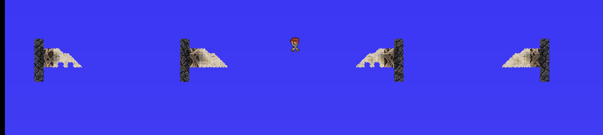
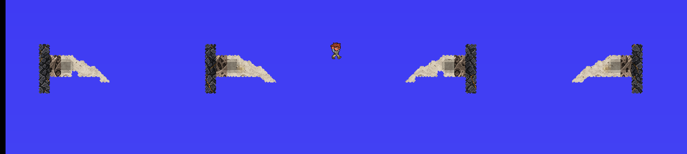
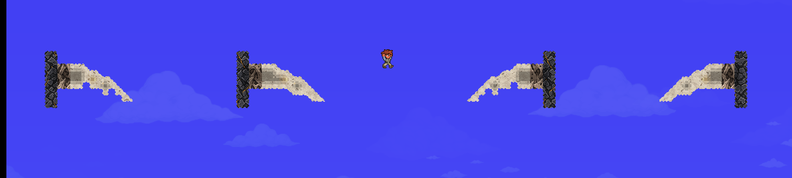

# Rib contour N — native comparison, September12

Build `F1D5D1103DF3A885C719E175AA5B40AF5A25C9C7D8A1EC62287EED19D23BDD4C`;
mirror `19f4084c12324521a4781f3f6131781b/apogean`.0warnings/errors,466 unchanged
art/map pins. No temporary close-background injector/probe in this build.

The new124×82 specimen at(1116,60) placed in empty air after2 candidates.
592 solids,10168 exact cells. Eight nonempty earlier bounds preserved, including
the shallow trial. It contains no wall backdrop to hide cut-ins.

Each raw row, left to right: **old right, candidate right, old left, candidate left**.
Lengths8,11,12. These are unedited native CaptureManager PNGs at16px per tile,
with the actual starter character for scale. Four explicitly diagnostic row
lights, not natural illumination. The capture renderer uses a blue sky here;
the observed live game window had a black space backdrop. No background repair
or aesthetic acceptance is implied by these captures.

Observation: the candidate removes the old large square underside notches, in
both directions. The outer shape is continuous and its native slope triangles
face as intended. Broad internal cortical bands and the porous-root contrast
remain: this is a shape improvement, not final material/art approval or proof
that the rib feels correct in traversal. No retexturing or shader change.

Source captures retained in tML Captures:

- `Apogean Maw Rib Contour 0-inspection 20260912-214913.png`
- `Apogean Maw Rib Contour 1-inspection 20260912-215006.png`
- `Apogean Maw Rib Contour 2-inspection 20260912-215116.png`

Native save21:47:30UTC and reopen with Plain pass exact creation/interaction
hash `6F7998FFECA9D342C28B3A7FC2F8E319FE3AB73598956BB221945EF35AB4B4DF`.
Pristine checks pass after reload; no repair. Switching from the contour lamp
to shallow views releases the contour hold/lights before the old scene takes
over. Native rib1/rib2/rib3/pocket/rib1/reload/pristine replay21:51:51–54UTC is
clean. Final safe-save21:52:30UTC retains the same contour hash and shallow
`24163E65FC677E84DA67BBE7DC7E1535CEBB4096AE3326516418EC0A6213F5A5`.
Normal main-menu Exit closes the process afterward.

`native-n-contours.json` contains66 scoped native records and0 caught relevant
draw failures. The known grove checkpoint failure on gg entry remains separate:
expected87B951FE,actualE56E85A3; it refused rebuilding as designed. This old failure
is not erased by the Maw-scoped exporter or the contour result. No ordinary
world, existing art bank, shallow geometry or worldgen path was changed.
