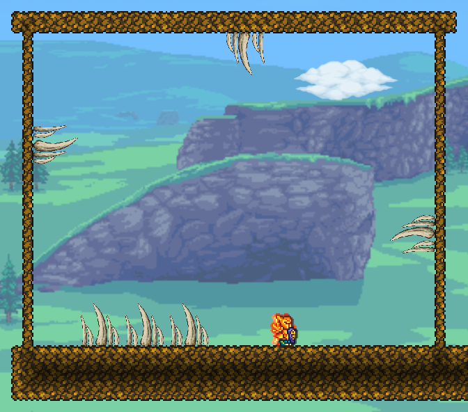
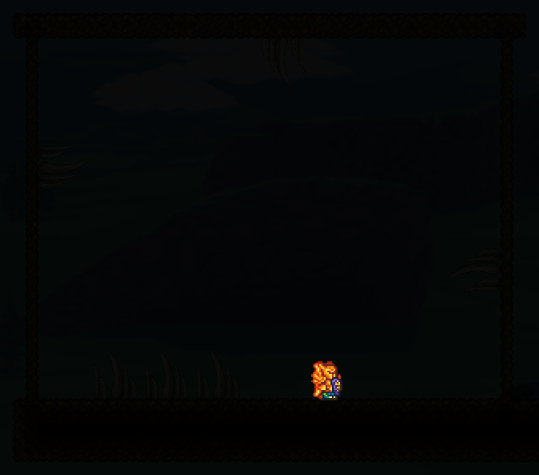
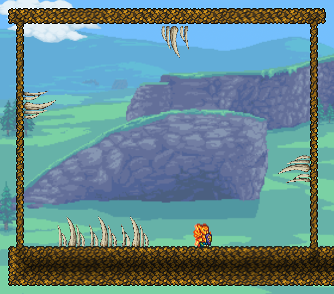

# Maw tooth cluster — four-face native fixture

September 9, 2026 local time. User accepts the tooth family and grouped art,
confirms thorn-style contact, easy whole-cluster pickup, and asks for floors,
ceilings and both walls. Keep the individual short/long/wide models unchanged.

Status: **fixture-pass**, not generated-mouth integration or multiplayer proof.
Installed optional candidate SHA256:
`137C0151D01EBF77C0B54BE1D53C79A57C30C2CA21BF138652D4E1FBD8E51654`.
Final isolated build: 0 warnings, 0 errors; installed tML2026.7.3.0.

## Native renders



Unedited native CaptureManager output, 672x592. This is a rectangular QA room,
not the planned Gullet, a generated safe ledge or final Maw background routing.
Floor/ceiling roots embed4px; side roots sit flush. Five original teeth per
64x64 group. Three adjacent groups demonstrate dense placement without redrawing
the accepted silhouettes. Same item recovers from every facing.



Night is naturally very dark: these teeth do not emit light. This verifies an
unlit sample, not polished hazard readability. Future Maw lighting/amber and a
torch-lit readability sample remain necessary before scene acceptance.

## Evidence and limits

- Static compiler/validator preserves the original upright pixels, eight-color
  palette and three exact rotations; atlas288x72, mask16384 bytes.5912 opaque
  pixels across all four facings. Eight real CLI negative controls reject
  dimensions, padding, white contamination, soft alpha, severed art, wrong mask,
  source hash and an unrotated side variant.
- Live native matrix:202 checks plus16384 loaded-texture/contact comparisons
  at19:02:44 and again19:04:52 after actual save/reload at19:04:01. All six
  persisted display objects remain intact. No rebuild to manufacture a pass.
- Tests use automatic native anchor selection (no forced alternate), actual
  TileLoader draw offsets, transparent-vs-opaque contacts, non-solid collision,
  actuated-segment safety, native Player.Hurt/immunity, mining all16 parts on
  each orientation with35 pick power, exactly one recovered item, missing
  support rejection, and all16 support-removal cases.
- These are native API/render checks, NOT actual mouse/item-placement input,
  multiplayer or NPC damage certification. No free crafting recipe was added.
- The415 other Content PNGs in the preceding floor candidate remain identical;
  only this cluster's optional atlas changed (plus its mask). All individual
  tooth sprites, backgrounds and arrival pod remain unchanged. No ordinary
  world was opened or modified. Distribution and acid were not implemented.

Scoped logs: `native-checks.log` (final202 checks twice),
`before-offset-fix.log` (198 checks, failed visual seam),
`historical-floor-checks.log` (prior54 floor-only checks).

## Caught regression: metadata did not prove placed rendering



Initial31DB0C35 candidate chose the right ceiling alternate but rendered it
with the base floor's +4px offset. Inspecting installed TileLoader revealed
SetDrawPositions initializes from base style0. ModTile.SetDrawPositions now
sets the actual orientation's Y offset, while retaining native tile rendering,
lighting and coatings. Side offsets are zero: do not move only preview/contact
geometry when native horizontal drawing has no matching offset hook.

`Test-MawClusterCeilingCapture.ps1` reads the bounded daylight socket. Before:
0 bone pixels (RED). Corrected screenshot:77 bone pixels (PASS; minimum10).
Keep the rejected capture as a negative control. This detector is specific to
the named room/daylight composition, not a general visual-quality metric.

Reference: [official TileObjectData alternate/style metadata](https://docs.tmodloader.net/docs/stable/class_tile_object_data.html).
Placed-offset behavior was checked against the installed build, not inferred
from that documentation alone. No decompiled game source is redistributed.

## Reproduce safely

Use existing gg / Apogee Native Visual V3 in single-player only. The saved
orientation room is5856,500,104x42. **Do not run orientation-build again.** The
old separate floor gallery has a user-mined display: do not recreate or reset it.

Build with every accepted override so a plain build does not drop prior art:

```powershell
pwsh -NoProfile -File Tools/Build-ApogeanIsolated.ps1 `
  -WastesCutoutCandidateDirectory Art/Candidates/WastesFarCity-v1/QA-Package-v1 `
  -WastesCityCandidateDirectory Art/Candidates/WastesFarCity-v1/Runtime-v1 `
  -WastesScaleCandidateDirectory Art/Candidates/WastesMidRuins-v2/ScaleStudy-v3 `
  -WastesDepotAssemblyDirectory Art/Candidates/WastesMidRuins-v2/ComponentAssembly-v1 `
  -WastesStationBridgeDirectory Art/Candidates/WastesStationBridge-v1/Study `
  -WastesMidDepthDirectory Art/Candidates/WastesMidDepth-v2/EdgeReview `
  -ArrivalPodCandidateDirectory Art/Candidates/ArrivalPod-v1/Native-v3 `
  -MawBoneCandidateDirectory Art/Candidates/MawBone-v1/MaskedNative-v2 `
  -MawFangCandidateDirectory Art/Candidates/MawTooth-v1/Native-v1 `
  -MawToothArtCandidateDirectory Art/Candidates/MawToothFamily-v1/Native-v1 `
  -MawToothClusterCandidateDirectory Art/Candidates/MawToothCluster-v1/Native-v2 `
  -KeepWorkspace
pwsh -NoProfile -File Tools/Request-MawClusterValidation.ps1 -Case orientation-reload
```

Check consumption/result before another request. `orientation-day/night/capture`
and `orientation-release` are available. `save-and-quit` restores viewing state
before saving. Candidate source/mask, validator and native fixture are separate
tools; a static pass is never a substitute for render inspection.

The corrected installed mirror is in local Temp/ApogeanTmlBuild/
222f7ffc00a24f69bd32a89e3b649920/apogean. Backup of previous package and gg/V3
before this change: Temp/ApogeanClusterOrientationBackup-
1fcf56166edd4c0488c7e6f9da369f5b. Preserve those; do not overwrite regular worlds.

## Remaining gates

The older preserved-grove reload assertion remains **RED**:
expected87B951FEB5C9FA9056E12F69F6862C946A7624328210500971B319E56B9929E4,
actualBFE03BFD4509E9B076D48B742B8B55F5E6EFEF713B74534D6BC625F2BA375541.
Actual is unchanged across these reloads and all cluster before/after guards.
Do not rebuild/rebaseline it or report the entire mod as passing.

Next: user/manual placement review, separate individual-tooth physics gate,
then a bounded mixed-mouth generation trial. Full four-cell flat solid support
is required for this4x4 group; background walls, slopes, half blocks and platforms
are not supported attachment surfaces. Design placement around those constraints
rather than adding safe ledges. Optional acid remains Wayfinder#27;#26 stays open.
