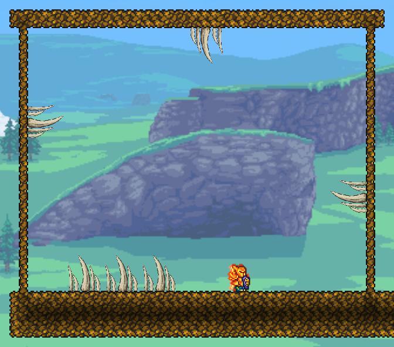

# Maw cluster: rooted, upward-curling wall pair

September 9, 2026 (America/Chicago). **Fixture-pass; new wall appearance awaits
user review.** This corrects rejected v2 sockets/handedness, not a new tooth
design, generated Maw, or completed multiplayer certification.



Unedited native CaptureManager image,672x592; gg provides player scale.
The rectangle and vanilla/resource-pack backdrop are the test fixture, NOT
the Gullet layout, safe ledges, or final biome routing.

## What changed

- User confirmed rounded backs below, tips curling upward on BOTH side walls.
  Right mirrors left. Floor, ceiling, source cluster and all individual
  short/long/wide pixels remain unchanged.
- A flush tile boundary was not a flush visible joint: Maw soil recedes2px.
  The old daylight image fails the new detector at15/40 root rows. Root
  pixels now embed4px into support on every face.
- Native tile rendering is retained. A416x144 atlas preserves the288x72
  preview/saved-frame bank; side drawing uses24px centered cells with8px
  asymmetric empty padding. That moves visible16px cells4px into terrain.
  Preview and contact use the same offset. No saved-frame migration.
- Same non-solid thorn-style group, native immunity,30 provisional damage,
  starter-pick whole-cluster recovery. All four full solid support cells
  required; background walls, slopes, half-blocks and platforms are not anchors.

## Evidence

- Full isolated build:0 warnings,0 errors. Package SHA256:
  `01FF09E0F2B37FEB916EC6D44225C2DD7F7EF767B09F040CD4AB908F0CAA8C41`.
- All415 other Content PNGs match preceding v2 build. Only cluster atlas PNG
  differs; its contact mask changes with the right-side mirroring.
- Static gate compares all59904 atlas pixels,16384 mask cells and8192
  centered-cell projections independently of compiler inverse mapping.
  Approved source/item hashes are checked. Six real CLI corruptions fail:
  padding, soft alpha, wrong curve, wrong inset, mask and hash.
- In-game202-check matrix at19:32:41 and19:33:56; actual save/quit completed
  at19:33:16 between runs. Six saved display objects intact, no rebuild.
  Each run compares16384 loaded-texture/contact samples and the side draw
  bank against preview/contact projection. Tests include automatic native
  anchor choice, actual TileLoader offsets, non-solid collision, actuation,
  Player.Hurt/immunity,35-power mining of all16 parts per facing, exactly one
  drop, unsupported placement and each of16 support-loss cases.
- Both `day.png` and `reloaded-day.png` pass40 wall-root samples with no
  daylight scenery gap, and77 ceiling bone pixels (minimum10). Visual
  inspection confirms upward mirrored curves and intact floor/ceiling.
  Captures originate from `Apogean Maw Orientations 20260910-003256.png`
  and `...003504.png`; filenames use UTC.
- `native-checks.log` is a scoped export, not a synthetic test summary.
  Native API/render tests do not certify manual cursor placement, full
  paint/coating combinations, multiplayer, NPC traps or night readability.

## Reproduce

Only gg / Apogee Native Visual V3 / single-player. Room5856,500,104x42 is saved.
**Never run orientation-build again or restore the user-mined old floor room.**

```powershell
pwsh -NoProfile -File Tools/Build-ApogeanIsolated.ps1 `
  -WastesCutoutCandidateDirectory Art/Candidates/WastesFarCity-v1/QA-Package-v1 `
  -WastesCityCandidateDirectory Art/Candidates/WastesFarCity-v1/Runtime-v1 `
  -WastesScaleCandidateDirectory Art/Candidates/WastesMidRuins-v2/ScaleStudy-v3 `
  -WastesDepotAssemblyDirectory Art/Candidates/WastesMidRuins-v2/ComponentAssembly-v1 `
  -WastesStationBridgeDirectory Art/Candidates/WastesStationBridge-v1/Study `
  -WastesMidDepthDirectory Art/Candidates/WastesMidDepth-v2/EdgeReview `
  -ArrivalPodCandidateDirectory Art/Candidates/ArrivalPod-v1/Native-v3 `
  -MawBoneCandidateDirectory Art/Candidates/MawBone-v1/MaskedNative-v2 `
  -MawFangCandidateDirectory Art/Candidates/MawTooth-v1/Native-v1 `
  -MawToothArtCandidateDirectory Art/Candidates/MawToothFamily-v1/Native-v1 `
  -MawToothClusterCandidateDirectory Art/Candidates/MawToothCluster-v1/Native-v3 `
  -KeepWorkspace
pwsh -NoProfile -File Tools/Test-MawClusterRootedCandidate.ps1
pwsh -NoProfile -File Tools/Test-MawClusterRootedValidator.ps1
pwsh -NoProfile -File Tools/Request-MawClusterValidation.ps1 -Case orientation-reload
```

Do not rebuild while tML holds its package. Keep all override arguments;
a plain build omits staged candidate art. Check request consumption/result
before queuing the next. An inactive single-player client can pause polling;
activate the game rather than assuming a queued save happened.

Use `orientation-capture` for native output, `orientation-release` to return
control and `save-and-quit` to restore viewing state then save. Socket checks:

```powershell
pwsh -NoProfile -File Tools/Test-MawClusterWallSockets.ps1 -CapturePath Art/Validation/MawToothCluster-2026-09-09/Rooted-v3/reloaded-day.png
pwsh -NoProfile -File Tools/Test-MawClusterCeilingCapture.ps1 -CapturePath Art/Validation/MawToothCluster-2026-09-09/Rooted-v3/reloaded-day.png
# Expected failure; retain as the actual regression input:
pwsh -NoProfile -File Tools/Test-MawClusterWallSockets.ps1 -CapturePath Art/Validation/MawToothCluster-2026-09-09/day-four-way.png -AtlasPath Art/Candidates/MawToothCluster-v1/Native-v2/cluster-atlas.png
```

These daylight detectors apply only to this exact room/capture, not arbitrary
biomes or an art-quality score.

Build mirror: local Temp/ApogeanTmlBuild/ef71c174d7784d4eb2b4d3828019a031/apogean.
Saved pre-update package/player/world backup:
Temp/ApogeanRootedClusterBackup-6da0890f770e40489a7358d4c3df01f8.

## Remaining gates / preserved failure

Known grove reload assertion is still **RED**, unchanged across these runs:
expected87B951FEB5C9FA9056E12F69F6862C946A7624328210500971B319E56B9929E4;
actualBFE03BFD4509E9B076D48B742B8B55F5E6EFEF713B74534D6BC625F2BA375541.
Do not rebuild, rebaseline, or claim the whole mod passes.

Next: user wall-socket/manual placement review, independent individual-tooth
hazard gate, then bounded mixed-mouth distribution. No regular-world edits,
generator/acid changes or dependency. Wayfinder26 stays open;27/28 separate.

## Sources

Installed tML2026.7.3.0 TileDrawing/TileObject behavior was inspected read-only:
placed tiles center wider cells; previews use TileObjectData.DrawXOffset.
No decompiled engine source is redistributed.
[ModTile.SetDrawPositions](https://docs.tmodloader.net/docs/stable/class_mod_tile.html)
and [TileDrawInfo](https://docs.tmodloader.net/docs/stable/class_tile_draw_info.html)
document the available draw inputs; live native output validates the offsets.
